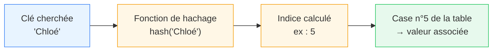

Ce chapitre contient 4 pages:
* [cours](../page10) 
* TP tableur: [TP3a](../page5)
* TP avec visualisation, tableau de notes: [TP3b](../page51)
* TP sur les sustemes scolaires européens: [TP3c](../page52)

# Les tables de données en Python

*Ce cours s'appuie sur les notions déjà vues sur les [types simples](../page1/) et les [types construits](../page2/) (listes, dictionnaires, mutabilité). Il prépare l'[exercice sur la table des pays](../page5/).*

Une grande partie des données que l'on manipule en informatique se présentent sous forme de **tables** : un ensemble d'enregistrements (une ligne par individu, par mesure, par pays...), chacun décrit par les mêmes attributs (les colonnes). C'est le cas d'une feuille de tableur, d'une table de base de données, ou d'un fichier `.csv`.

## Modéliser une table avec des listes
La structure la plus simple pour représenter une table en Python est une **liste de listes** : chaque ligne de la table est elle-même une liste.

Par convention, on place souvent en première ligne les **étiquettes de colonnes** (le nom de chaque attribut), puis une ligne par individu :

```python
table = [
    ["Pays", "Nb élèves secondaire", "Jours de vacances/an", "Durée secondaire (ans)"],
    ["France", 5660000, 112, 7],
    ["Allemagne", 6900000, 65, 9],
    ["Espagne", 3500000, 105, 6],
    ["Grèce", 700000, 119, 6],
]
```

## Accéder à une valeur
Une table étant une liste de listes, on accède à une valeur précise avec un **double indiçage** : `table[i][j]` désigne la valeur de la ligne `i`, colonne `j`.

```python
table[0]
# affiche ['Pays', 'Nb élèves secondaire', 'Jours de vacances/an', 'Durée secondaire (ans)']
table[1]
# affiche ['France', 5660000, 112, 7]
table[1][0]
# affiche 'France'
table[1][1]
# affiche 5660000
```

## Parcourir une table
Parcourir les **lignes** de données (sans l'en-tête) se fait avec une boucle bornée classique :

```python
for ligne in table[1:]:
    print(ligne)
```

Pour parcourir les **lignes** et **colonnes**, on imbrique une seconde boucle, en s'appuyant sur `range(len(table[0]))` :

```python
for ligne in table[1:]:
    # pour chaque ligne de datas
    for j in range(len(ligne)):
        # j est le numero de colonne
        print(table[0][j], ":", ligne[j])
    print("---")
```

*... Affiche ...*
```
Pays : France
Nb élèves secondaire : 5660000
Jours de vacances/an : 112
Durée secondaire (ans) : 7
---
Pays : Allemagne
Nb élèves secondaire : 6900000
Jours de vacances/an : 65
Durée secondaire (ans) : 9
---
Pays : Espagne
Nb élèves secondaire : 3500000
Jours de vacances/an : 105
Durée secondaire (ans) : 6
---
Pays : Grèce
Nb élèves secondaire : 700000
Jours de vacances/an : 119
Durée secondaire (ans) : 6
---
```

## Traitement des données en ligne
Pour les exemples qui suivent, le traitement des données d'une table porte sur ses valeurs numériques. Par exemple, avec la somme des données de chaque ligne et leur affichage:

Le parcours de la table entière nécéssite d'utiliser deux boucles imbriquées, afin de parcourir toutes les lignes (indice `i`), et toutes les colonnes de chaque ligne (indice `j`).

```python
datas = [[5660000, 112, 7],
    [6900000, 65, 9],
    [3500000, 105, 6],
    [700000, 119, 6]]

for i in range(len(datas)):
    # on initialise s à chaque nouvelle ligne
    s = 0
    for j in range(len(datas[0])):
        s = s + datas[i][j]
    # on affiche s a la fin de chaque ligne
    print(s)
```

## Traitement de données en colonne
On souhaite faire la somme des valeurs dans la colonne `c`. On propose cette fois un parcours de la table `datas` par élément, avec `for ligne in datas:`

```python
datas = [[5660000, 112, 7],
    [6900000, 65, 9],
    [3500000, 105, 6],
    [700000, 119, 6]]

c = 1
s = 0
for ligne in datas:
    s += ligne[c]
print(s)
```

# Copier une table
Le cours sur les types construits a montré que copier une liste par simple affectation (`copie = original`) crée un **alias** : les deux noms désignent le même objet.

Pour une liste « plate », on évite ce piège avec `original[:]` ou `list(original)`. Mais pour une **liste de listes**, il faut être plus prudent :

```python
donnees = table[1:]           # copie de la liste externe
# donnees vaut [['France', 5660000, 112, 7],... ['Grèce', 700000, 119, 6]]
donnees[1][1] = 0
print(table[1][1])
# affiche 0 !! table a été modifiée alors qu'on n'a modifié que "donnees"
print(table)
# [['Pays',  'Nb élèves secondaire',...], ['France', 0, 112, 7],... ['Grèce', 700000, 119, 6]]
```

`table[1:]` crée bien une **nouvelle liste externe**, mais ses éléments — les lignes — restent les **mêmes objets** que dans `table`. C'est une copie dite *de surface* (*shallow copy*) : seul le premier niveau est dupliqué.

Pour obtenir une copie totalement indépendante, y compris des lignes, il faut une copie *profonde* (*deep copy*), fournie par le module `copy` :

```python
from copy import deepcopy

donnees = deepcopy(table[1:])
donnees[0][1] = 0
table[1][1]
# affiche 5660000  # table n'a pas été modifiée cette fois
```

# Rechercher un extremum dans une colonne
Rechercher, par exemple, le pays ayant le plus grand nombre d'élèves (colonne d'indice 1) suit le schéma classique de recherche de maximum : on mémorise le meilleur candidat rencontré jusqu'ici, et on le met à jour à chaque ligne qui fait mieux.

```python
meilleure_ligne = table[1]
# meilleure_ligne vaut ["France", 5660000, 112, 7]
for ligne in table[2:]:
    # a la premiere iteration
    # ligne[1] vaut 6900000
    if ligne[1] > meilleure_ligne[1]:
        meilleure_ligne = ligne

print(meilleure_ligne[0], meilleure_ligne[1])
# affiche Allemagne 6900000
```

# Trier une table selon une colonne
Le cours sur les types construits a présenté `sorted` et `sort` pour trier une liste dans son ordre naturel. Ces deux outils acceptent en réalité un paramètre optionnel, `key`, qui indique **selon quel critère** comparer les éléments — utile ici puisqu'on ne veut pas trier des lignes entières « au hasard », mais selon une colonne précise.

`key` attend une **fonction** qui, appliquée à un élément, renvoie la valeur à utiliser pour la comparaison. Pour une fonction aussi courte, on utilise en général une **fonction lambda** (fonction anonyme, écrite en une ligne) plutôt qu'une fonction `def` complète :

```python
lambda ligne: ligne[1]
# équivaut à une fonction sans nom qui, à une ligne, associe ligne[1]
```

On peut alors trier la table selon le nombre d'élèves, du plus grand au plus petit :

```python
tri_par_effectif = sorted(table[1:], key=lambda ligne: ligne[1], reverse=True)
for ligne in tri_par_effectif:
    print(ligne[0], ligne[1])
# affiche
# Allemagne 6900000
# France 5660000
# Espagne 3500000
# Grèce 700000
```

*Documentation (extrait) :*
```
sorted(iterable, key=None, reverse=False)
    - key : fonction appliquée à chaque élément avant comparaison
    - reverse=True : tri décroissant plutôt que croissant
```

# Passer d'une table à des dictionnaires
Accéder à une valeur par sa position (`ligne[1]`) est efficace mais peu lisible : rien n'indique, à la lecture du code, que l'indice `1` correspond au nombre d'élèves. Une alternative consiste à représenter chaque ligne par un **dictionnaire**, où les clés sont les étiquettes de colonnes.

```python
etiquettes = table[0]
ligne_france = table[1]

France = {
    etiquettes[0]: ligne_france[0],
    etiquettes[1]: ligne_france[1],
    etiquettes[2]: ligne_france[2],
    etiquettes[3]: ligne_france[3],
}
# affiche {'Pays': 'France', 'Nb élèves secondaire': 5660000, 'Jours de vacances/an': 112, 'Durée secondaire (ans)': 7}
```

On peut généraliser cette construction à toutes les lignes de la table, à l'aide d'une boucle, pour obtenir un **dictionnaire de dictionnaires** — une structure très courante pour représenter des données structurées :

```python
pays_dict = {}
etiquettes = table[0]

for ligne in table[1:]:
    nom_pays = ligne[0]
    pays_dict[nom_pays] = {}
    for j in range(1, len(etiquettes)):
        pays_dict[nom_pays][etiquettes[j]] = ligne[j]

pays_dict['France']
# affiche {'Nb élèves secondaire': 5660000, 'Jours de vacances/an': 112, 'Durée secondaire (ans)': 7}
```

# Importer une table depuis un fichier CSV
Un fichier **CSV** (*Comma-Separated Values*) stocke une table sous forme de texte : chaque ligne du fichier est une ligne de la table, et les valeurs sont séparées par un caractère précis (une virgule `,` le plus souvent, mais un point-virgule `;` est fréquent dans les fichiers produits en France, la virgule y étant déjà utilisée comme séparateur décimal).

Le module `csv` de la bibliothèque standard permet de lire un tel fichier sans avoir à découper les lignes soi-même avec `split` :

```python
import csv

with open('datas/classe.csv', newline='') as csvfile:
    spamreader = csv.reader(csvfile, delimiter=';')
    classe = []
    for row in spamreader:
        classe.append(row)
```

Décomposons ce script :

* `open('datas/classe.csv', newline='')` ouvre le fichier. L'argument `newline=''` est recommandé par la documentation de `csv` pour éviter des problèmes de fin de ligne selon le système d'exploitation.
* `csv.reader(csvfile, delimiter=';')` construit un objet **itérable** : chaque itération donne la ligne suivante du fichier, déjà découpée en liste de chaînes de caractères, selon le séparateur indiqué (ici `;`).
* La boucle `for row in spamreader:` parcourt ces lignes une par une, et le script les accumule dans la liste `classe` avec `append` — la même technique de **construction de liste par accumulation** que celle vue avec `while`/`for` dans le TP sur les listes.

À la fin, `classe` est une liste de listes, exactement comme la table `table` du début de ce cours — on peut donc lui appliquer tout ce qui vient d'être vu : parcours, copie, recherche d'extremum, tri par clé, conversion en dictionnaires.

*Point de vigilance :* le module `csv` lit **toujours** les valeurs comme des chaînes de caractères, y compris les nombres. Une valeur `"5660000"` lue dans un fichier CSV doit être convertie explicitement avec `int(...)` ou `float(...)` avant tout calcul (voir le cours sur les [conversions de types](../page1/)).

*Pour aller plus loin :* le module `csv` propose aussi `csv.DictReader`, qui utilise automatiquement la première ligne du fichier comme clés et renvoie directement chaque ligne sous forme de dictionnaire — ce qui réalise en une seule instruction ce que la section précédente a construit à la main :

```python
with open('datas/classe.csv', newline='') as csvfile:
    lecteur = csv.DictReader(csvfile, delimiter=';')
    for ligne in lecteur:
        print(ligne)
# chaque "ligne" est un dictionnaire, par exemple :
# {'Pays': 'France', 'Nb élèves secondaire': '5660000', ...}
```

# Complexité d'accès : dictionnaires imbriqués vs listes de listes

## 1. Le paragraphe de cours

Un dictionnaire Python est implémenté à l'aide d'une **table de hachage** : chaque clé est transformée par une fonction de hachage en un indice qui pointe directement vers l'emplacement mémoire où se trouve la valeur associée. Ainsi, accéder à `dico[cle]` ne nécessite pas de parcourir le dictionnaire élément par élément : on calcule l'emplacement directement, ce qui donne une complexité **en moyenne constante, $O(1)$**, quel que soit le nombre $n$ de couples clé/valeur stockés. Cette propriété se conserve pour les dictionnaires imbriqués : accéder à `dico[cle1][cle2]` revient à effectuer deux accès en $O(1)$ successifs (un par niveau d'imbrication), donc une complexité globale en $O(1)$ elle aussi, indépendante de la taille du dictionnaire à chaque niveau.

Il en va tout autrement pour une **liste de listes**. Une liste ne connaît que des positions numériques (des indices `0, 1, 2, ...`) : elle ne peut pas retrouver un élément à partir d'une « clé » sans le comparer un par un aux éléments qu'elle contient. Rechercher une valeur associée à un identifiant dans une liste de listes impose donc un **parcours linéaire**, de complexité $O(n)$ dans le pire des cas (et $O(n \times m)$ si l'on doit chercher dans des sous-listes de taille $m$), $n$ étant le nombre d'éléments parcourus avant de trouver (ou non) celui qui est cherché.

La différence essentielle est donc la suivante : le temps d'accès à une donnée dans un dictionnaire ne dépend (en moyenne) pas du nombre d'éléments qu'il contient, alors que dans une liste, ce temps croît avec le nombre d'éléments à parcourir. C'est ce qui justifie l'usage des dictionnaires — y compris imbriqués — dès qu'une structure de données doit permettre des recherches fréquentes par identifiant plutôt que par position.

---

## 2. Schéma

### a. Dictionnaire — accès direct par hachage



Un seul calcul (le hachage de la clé) suffit à localiser la donnée : le nombre d'étapes **ne dépend pas** du nombre d'éléments stockés.

### b. Liste de listes — parcours séquentiel


Ici, il faut comparer la clé cherchée à chaque élément, un par un, jusqu'à la trouver (ou parcourir toute la liste si elle est absente) : le nombre d'étapes **croît avec le nombre d'éléments** stockés.


## 3. Exemple chiffré : mesure du temps d'exécution

Le code ci-dessous compare, pour des tailles croissantes de données, le temps nécessaire pour rechercher un élément :
- dans un **dictionnaire** (recherche par clé) ;
- dans une **liste de listes** de la forme `[[identifiant, valeur], [identifiant, valeur], ...]` (recherche par parcours).

```python
import time

def construire_dictionnaire(n):
    return {f'id_{i}': i for i in range(n)}

def construire_liste_de_listes(n):
    return [[f'id_{i}', i] for i in range(n)]

def recherche_dictionnaire(dico, cle):
    return dico[cle]

def recherche_liste(liste, cle):
    for identifiant, valeur in liste:
        if identifiant == cle:
            return valeur
    return None

tailles = [1000, 10000, 100000, 1000000]

print(f"{'taille':>10} | {'temps dict (s)':>15} | {'temps liste (s)':>16}")
for n in tailles:
    dico = construire_dictionnaire(n)
    liste = construire_liste_de_listes(n)
    cle_cherchee = f'id_{n - 1}'  # dernier élément : pire cas pour la liste

    debut = time.perf_counter()
    recherche_dictionnaire(dico, cle_cherchee)
    temps_dict = time.perf_counter() - debut

    debut = time.perf_counter()
    recherche_liste(liste, cle_cherchee)
    temps_liste = time.perf_counter() - debut

    print(f"{n:>10} | {temps_dict:>15.8f} | {temps_liste:>16.8f}")
```

**Résultat attendu (ordre de grandeur, les valeurs exactes dépendent de la machine) :**

```
    taille |  temps dict (s) |  temps liste (s)
      1000 |      0.00000030 |       0.00003500
     10000 |      0.00000030 |       0.00035000
    100000 |      0.00000030 |       0.00350000
   1000000 |      0.00000030 |       0.03500000
```

**Interprétation** : le temps de recherche dans le dictionnaire reste (à peu près) constant quelle que soit la taille `n`, conformément à la complexité $O(1)$. Le temps de recherche dans la liste de listes, lui, est multiplié par 10 à chaque fois que `n` est multiplié par 10 : il **croît linéairement** avec `n`, conformément à la complexité $O(n)$.


# Suite
##### {}Cours{} 
##### {}TP3a{} Tableur
##### {}TP3b{} Tableau de notes et algorithmes (Visualisation)
##### {}TP3c{} Systemes scolaires européens
